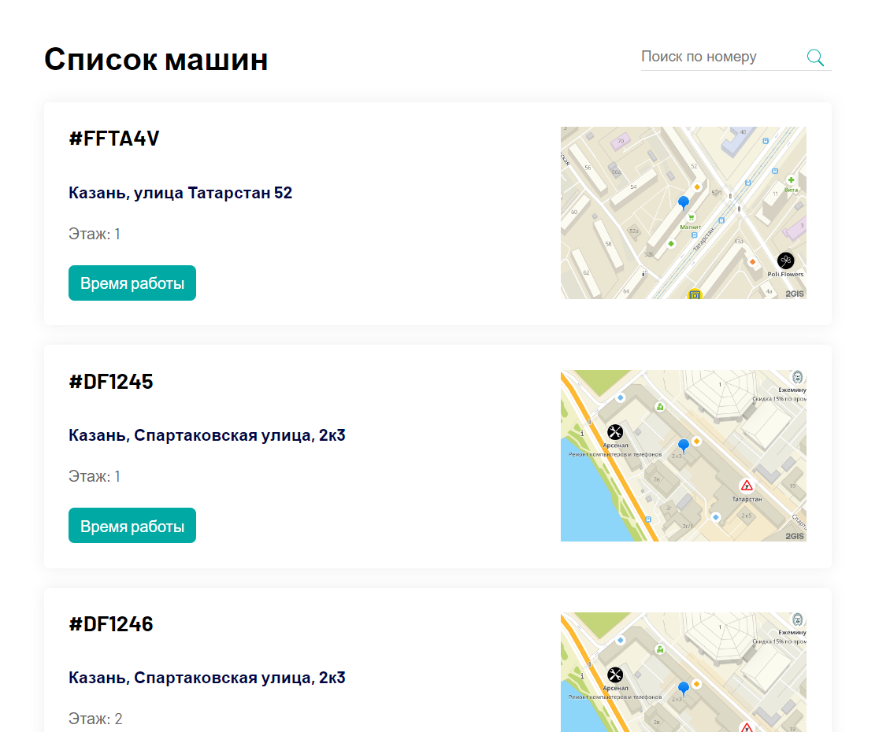
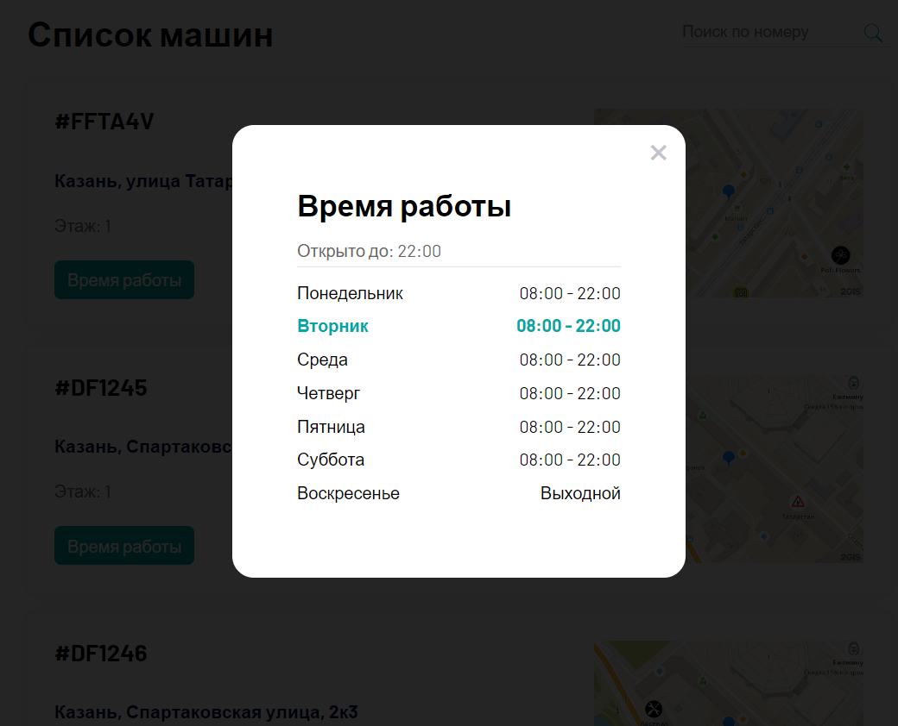

# Тестовое задание Simdelivery (Frontend)

This template should help get you started developing with Vue 3 in Vite.

## Задание

Требуется создать небольшое одностраничное приложение со списком автоматов
по продаже напитков (далее – машин), которые находятся в торговых точках.

## Функционал

Приложение должно содержать в себе:

- Список машин с информацией о машине и точке, в которой она расположена.
- Поле ввода поискового запроса должно позволять фильтровать список машин с
  помощью регистронезависимого поиска по вхождению искомой строки в адрес
  или серийный номер.
- Диалоговое окно, отображающее время работы выбранной торговой точки.

Каждый элемент списка должен содержать следующую информацию:

- Серийный номер машины (поле serialNumber в объекте из массива machines). В
  макете отображен через решетку:
- Тэги машины. В макете отображены после серийного номера, каждый тэг должен
  быть выделен определённым цветом на усмотрение разработчика, в макете:
  . Набор тэгов зависит от типа машин (идентификатор типа указан в поле
  typeId, а список всех типов в массиве machineTypes).
- Адрес торговой точки, в которой находится автомат (идентификатор торговой
  точки указан в поле tradePointId, а сами точки в массиве tradePoints). В макете:
- Этаж, указанный в объекте самой машины. В макете отображен отдельной
  строкой после адреса. В макете:
- Кнопка открытия диалогового окна с режимом работы. В макете:
- Изображение местоположения точки на карте с маркером (координаты указаны
  в объекте location внутри торговой точки). В макете

Диалоговое окно должно содержать следующую информацию:

- До скольких часов и минут точка работает сегодня, например:
- Расписание работы на всю неделю, где текущий день должен быть
  выделен/подчеркнут особым цветом, например:
  Само расписание хранится в объекте workingTime у каждой торговой точки. Где
  ключ – код дня недели (см. справку), а значение – строка с интервалом работы, в
  которой время открытия и закрытия разделены символом «;» (точка с запятой).

## Интерфейс

Дизайн интерфейса − на усмотрение разработчика, но главное требование – он
должен быть приятным и лаконичным, со скругленными краями блоков и элементов,
содержать тени при необходимости. Желательно использовать светлые оттенки
серого, синего и зеленого.

## Stack

Нельзя использовать: CSS/HTML препроцессоры и фреймворки; UI-киты и любые
другие библиотеки, которые не указаны в следующем списке.
Что нужно использовать:

- Чистый HTML
- Чистый CSS
- JavaScript
- Пакетный менеджер Yarn
- Фреймворк Vue
- Стейт менеджер Vuex
- HTTP клиент Axios
- json-server для имитации API https://github.com/typicode/json-server
  Для получения данных из json-сервера требуется использовать Axios.
  Полученные данные о машинах, торговых точках и типах машин нужно хранить в
  виде объекта в хранилище (файл store/index.js).
  Для отображения местоположения точки на карте требуется использовать сервис
  Static API карт 2ГИС: https://api.2gis.ru/doc/maps/1.0/static
  Все составные части интерфейса должны быть реализованы в виде компонентов.

## Реализация

<div style="text-align: center">




</div>

## В проекте установлены следующие библиотеки

- **Vue**
- **Vuex**
- **Axios**

## Project Setup

```sh
yarn
```

```sh
npm install -g json-server
```

### Compile and Hot-Reload for Development

```sh
json-server --watch db.json

```

```sh
yarn dev
```
